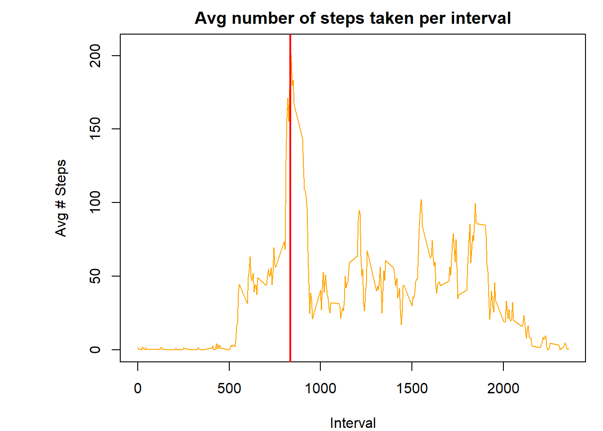
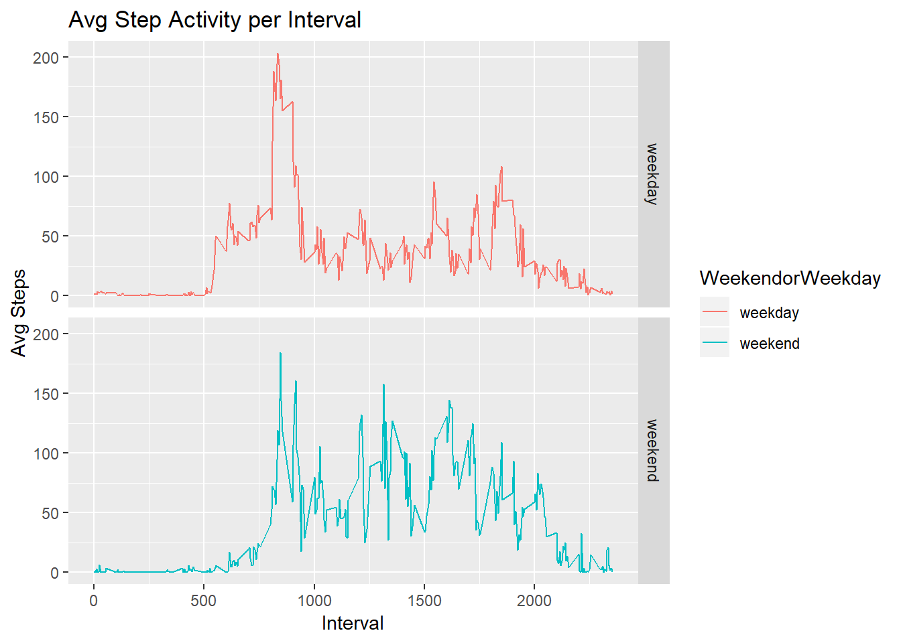

## Reproducible Research - Course Assignment #1

This assignment makes use of data from a personal activity monitoring device. This device collects data at 5 minute intervals through out the day. The data consists of two months of data from an anonymous individual collected during the months of October and November, 2012 and include the number of steps taken in 5 minute intervals each day.


```r
data <- read.csv("activity.csv", header=TRUE, sep=",", colClasses=c("numeric","Date","numeric"))

data$FormattedDate <- as.Date(data$date,format="%Y/%m/%d")

#Add column for day information

uniqueDates <- unique(data$FormattedDate)

uniqueIntervals <- unique(data$interval)
```

## Histogram of the total number of steps taken each day


```r
# Get Steps per day

stepsSplit <- split(data$steps, data$date)
totalStepsPerDay <- sapply(stepsSplit,sum,na.rm=TRUE)

# Mean of total steps per day
meanx <- mean(totalStepsPerDay,na.rm=TRUE)

# Median of total steps per day
medianx <- median(totalStepsPerDay,na.rm=TRUE)

par(mar=c(4,7,2,1))
hist(totalStepsPerDay, col="grey", main="Total number of steps taken each day",xlab="Steps",breaks=8)

lines(c(meanx,meanx), c(0,14), col="red", lwd=2)
text(meanx, 15, "Mean", col="red", adj=c(1,0))
text(meanx, 14, round(meanx,0), col="red", adj=c(1,0))

lines(c(medianx,medianx), c(0,14), col="blue", lwd=2)
text(medianx, 15, "Median", col="blue", adj=c(0,0))
text(medianx, 14, round(medianx,0), col="blue", adj=c(0,0))
```

<!-- -->

## Mean and median number of steps taken each day


```r
# Get mean per day
meanSteps <- sapply(stepsSplit, mean, na.rm=TRUE)
meanDF <- data.frame(date=uniqueDates, meanSteps=meanSteps, row.names=NULL)
meanDF
```

```
##          date  meanSteps
## 1  2012-10-01        NaN
## 2  2012-10-02  0.4375000
## 3  2012-10-03 39.4166667
## 4  2012-10-04 42.0694444
## 5  2012-10-05 46.1597222
## 6  2012-10-06 53.5416667
## 7  2012-10-07 38.2465278
## 8  2012-10-08        NaN
## 9  2012-10-09 44.4826389
## 10 2012-10-10 34.3750000
## 11 2012-10-11 35.7777778
## 12 2012-10-12 60.3541667
## 13 2012-10-13 43.1458333
## 14 2012-10-14 52.4236111
## 15 2012-10-15 35.2048611
## 16 2012-10-16 52.3750000
## 17 2012-10-17 46.7083333
## 18 2012-10-18 34.9166667
## 19 2012-10-19 41.0729167
## 20 2012-10-20 36.0937500
## 21 2012-10-21 30.6284722
## 22 2012-10-22 46.7361111
## 23 2012-10-23 30.9652778
## 24 2012-10-24 29.0104167
## 25 2012-10-25  8.6527778
## 26 2012-10-26 23.5347222
## 27 2012-10-27 35.1354167
## 28 2012-10-28 39.7847222
## 29 2012-10-29 17.4236111
## 30 2012-10-30 34.0937500
## 31 2012-10-31 53.5208333
## 32 2012-11-01        NaN
## 33 2012-11-02 36.8055556
## 34 2012-11-03 36.7048611
## 35 2012-11-04        NaN
## 36 2012-11-05 36.2465278
## 37 2012-11-06 28.9375000
## 38 2012-11-07 44.7326389
## 39 2012-11-08 11.1770833
## 40 2012-11-09        NaN
## 41 2012-11-10        NaN
## 42 2012-11-11 43.7777778
## 43 2012-11-12 37.3784722
## 44 2012-11-13 25.4722222
## 45 2012-11-14        NaN
## 46 2012-11-15  0.1423611
## 47 2012-11-16 18.8923611
## 48 2012-11-17 49.7881944
## 49 2012-11-18 52.4652778
## 50 2012-11-19 30.6979167
## 51 2012-11-20 15.5277778
## 52 2012-11-21 44.3993056
## 53 2012-11-22 70.9270833
## 54 2012-11-23 73.5902778
## 55 2012-11-24 50.2708333
## 56 2012-11-25 41.0902778
## 57 2012-11-26 38.7569444
## 58 2012-11-27 47.3819444
## 59 2012-11-28 35.3576389
## 60 2012-11-29 24.4687500
## 61 2012-11-30        NaN
```

```r
# Get median per day
medianSteps <- sapply(stepsSplit, median, na.rm=TRUE)
medianDF <- data.frame(date=uniqueDates, medianSteps=medianSteps, row.names=NULL)
medianDF
```

```
##          date medianSteps
## 1  2012-10-01          NA
## 2  2012-10-02           0
## 3  2012-10-03           0
## 4  2012-10-04           0
## 5  2012-10-05           0
## 6  2012-10-06           0
## 7  2012-10-07           0
## 8  2012-10-08          NA
## 9  2012-10-09           0
## 10 2012-10-10           0
## 11 2012-10-11           0
## 12 2012-10-12           0
## 13 2012-10-13           0
## 14 2012-10-14           0
## 15 2012-10-15           0
## 16 2012-10-16           0
## 17 2012-10-17           0
## 18 2012-10-18           0
## 19 2012-10-19           0
## 20 2012-10-20           0
## 21 2012-10-21           0
## 22 2012-10-22           0
## 23 2012-10-23           0
## 24 2012-10-24           0
## 25 2012-10-25           0
## 26 2012-10-26           0
## 27 2012-10-27           0
## 28 2012-10-28           0
## 29 2012-10-29           0
## 30 2012-10-30           0
## 31 2012-10-31           0
## 32 2012-11-01          NA
## 33 2012-11-02           0
## 34 2012-11-03           0
## 35 2012-11-04          NA
## 36 2012-11-05           0
## 37 2012-11-06           0
## 38 2012-11-07           0
## 39 2012-11-08           0
## 40 2012-11-09          NA
## 41 2012-11-10          NA
## 42 2012-11-11           0
## 43 2012-11-12           0
## 44 2012-11-13           0
## 45 2012-11-14          NA
## 46 2012-11-15           0
## 47 2012-11-16           0
## 48 2012-11-17           0
## 49 2012-11-18           0
## 50 2012-11-19           0
## 51 2012-11-20           0
## 52 2012-11-21           0
## 53 2012-11-22           0
## 54 2012-11-23           0
## 55 2012-11-24           0
## 56 2012-11-25           0
## 57 2012-11-26           0
## 58 2012-11-27           0
## 59 2012-11-28           0
## 60 2012-11-29           0
## 61 2012-11-30          NA
```
## Time series plot of the average number of steps taken (using time intervals)


```r
# Get Steps interval

stepsSplitperInterval <- split(data$steps, data$interval)
avgStepsPerInterval <- sapply(stepsSplitperInterval,mean,na.rm=TRUE)

par(mar=c(4,7,2,1))
plot(uniqueIntervals,avgStepsPerInterval, main="Avg number of steps taken per interval", type="l", xlab="Interval", ylab="Avg # Steps", col="orange")

#Add line with the max avg

maxAvg <- uniqueIntervals[which.max(avgStepsPerInterval)]
abline(v=maxAvg, col="red", lwd=2)
```

<!-- -->


## The 5-minute interval that, on average, contains the maximum number of steps


```r
maxAvg
```

```
## [1] 835
```

## Imputing Missing Values


```r
# Replace NAs using MICE package Predictive Mean Matching (PMM)

# Create new data set 
data2 <- data

## Number of NAs before impute

# Determine how many NAs
md.pattern(data2)
```

<!-- -->

```
##       date interval FormattedDate steps     
## 15264    1        1             1     1    0
## 2304     1        1             1     0    1
##          0        0             0  2304 2304
```

```r
tempData <- mice(data2,meth='pmm')
```

```
## 
##  iter imp variable
##   1   1  steps
##   1   2  steps
##   1   3  steps
##   1   4  steps
##   1   5  steps
##   2   1  steps
##   2   2  steps
##   2   3  steps
##   2   4  steps
##   2   5  steps
##   3   1  steps
##   3   2  steps
##   3   3  steps
##   3   4  steps
##   3   5  steps
##   4   1  steps
##   4   2  steps
##   4   3  steps
##   4   4  steps
##   4   5  steps
##   5   1  steps
##   5   2  steps
##   5   3  steps
##   5   4  steps
##   5   5  steps
```

```
## Warning: Number of logged events: 1
```

```r
#Select 2nd of 5 complete data set (new data set)
completeData <- complete(tempData,2)

#Make sure there are no NAs
md.pattern(completeData)
```

```
##  /\     /\
## {  `---'  }
## {  O   O  }
## ==>  V <==  No need for mice. This data set is completely observed.
##  \  \|/  /
##   `-----'
```

<!-- -->

```
##       steps date interval FormattedDate  
## 17568     1    1        1             1 0
##           0    0        0             0 0
```

```r
#Histogram, mean and median

# Get Steps per day

stepsSplitNew <- split(completeData$steps, completeData$date)
totalStepsPerDayNew <- sapply(stepsSplitNew,sum,na.rm=TRUE)

# Mean of total steps per day
meany <- mean(totalStepsPerDayNew,na.rm=TRUE)

# Median of total steps per day
mediany <- median(totalStepsPerDayNew,na.rm=TRUE)

par(mar=c(4,7,2,1))
hist(totalStepsPerDayNew, col="grey", main="Total number of steps taken each day",xlab="Steps",breaks=8)

lines(c(meany,meany), c(0,14), col="red", lwd=2)
text(meany, 15, "Mean", col="red", adj=c(1,0))
text(meany, 14, round(meany,0), col="red", adj=c(1,0))

lines(c(mediany,mediany), c(0,14), col="blue", lwd=2)
text(mediany, 15, "Median", col="blue", adj=c(0,0))
text(mediany, 14, round(mediany,0), col="blue", adj=c(0,0))
```

<!-- -->

```r
# Get mean per day
meanStepsNew <- sapply(stepsSplitNew, mean, na.rm=TRUE)
meanDFNew <- data.frame(date=uniqueDates, meanStepsNew=meanStepsNew, row.names=NULL)
meanDFNew
```

```
##          date meanStepsNew
## 1  2012-10-01   28.8680556
## 2  2012-10-02    0.4375000
## 3  2012-10-03   39.4166667
## 4  2012-10-04   42.0694444
## 5  2012-10-05   46.1597222
## 6  2012-10-06   53.5416667
## 7  2012-10-07   38.2465278
## 8  2012-10-08   28.8819444
## 9  2012-10-09   44.4826389
## 10 2012-10-10   34.3750000
## 11 2012-10-11   35.7777778
## 12 2012-10-12   60.3541667
## 13 2012-10-13   43.1458333
## 14 2012-10-14   52.4236111
## 15 2012-10-15   35.2048611
## 16 2012-10-16   52.3750000
## 17 2012-10-17   46.7083333
## 18 2012-10-18   34.9166667
## 19 2012-10-19   41.0729167
## 20 2012-10-20   36.0937500
## 21 2012-10-21   30.6284722
## 22 2012-10-22   46.7361111
## 23 2012-10-23   30.9652778
## 24 2012-10-24   29.0104167
## 25 2012-10-25    8.6527778
## 26 2012-10-26   23.5347222
## 27 2012-10-27   35.1354167
## 28 2012-10-28   39.7847222
## 29 2012-10-29   17.4236111
## 30 2012-10-30   34.0937500
## 31 2012-10-31   53.5208333
## 32 2012-11-01   35.3055556
## 33 2012-11-02   36.8055556
## 34 2012-11-03   36.7048611
## 35 2012-11-04   31.5173611
## 36 2012-11-05   36.2465278
## 37 2012-11-06   28.9375000
## 38 2012-11-07   44.7326389
## 39 2012-11-08   11.1770833
## 40 2012-11-09   39.9062500
## 41 2012-11-10   28.2743056
## 42 2012-11-11   43.7777778
## 43 2012-11-12   37.3784722
## 44 2012-11-13   25.4722222
## 45 2012-11-14   31.3159722
## 46 2012-11-15    0.1423611
## 47 2012-11-16   18.8923611
## 48 2012-11-17   49.7881944
## 49 2012-11-18   52.4652778
## 50 2012-11-19   30.6979167
## 51 2012-11-20   15.5277778
## 52 2012-11-21   44.3993056
## 53 2012-11-22   70.9270833
## 54 2012-11-23   73.5902778
## 55 2012-11-24   50.2708333
## 56 2012-11-25   41.0902778
## 57 2012-11-26   38.7569444
## 58 2012-11-27   47.3819444
## 59 2012-11-28   35.3576389
## 60 2012-11-29   24.4687500
## 61 2012-11-30   39.6215278
```

```r
# Get median per day
medianStepsNew <- sapply(stepsSplitNew, median, na.rm=TRUE)
medianDFNew <- data.frame(date=uniqueDates, medianStepsNew=medianStepsNew, row.names=NULL)
medianDFNew
```

```
##          date medianStepsNew
## 1  2012-10-01              0
## 2  2012-10-02              0
## 3  2012-10-03              0
## 4  2012-10-04              0
## 5  2012-10-05              0
## 6  2012-10-06              0
## 7  2012-10-07              0
## 8  2012-10-08              0
## 9  2012-10-09              0
## 10 2012-10-10              0
## 11 2012-10-11              0
## 12 2012-10-12              0
## 13 2012-10-13              0
## 14 2012-10-14              0
## 15 2012-10-15              0
## 16 2012-10-16              0
## 17 2012-10-17              0
## 18 2012-10-18              0
## 19 2012-10-19              0
## 20 2012-10-20              0
## 21 2012-10-21              0
## 22 2012-10-22              0
## 23 2012-10-23              0
## 24 2012-10-24              0
## 25 2012-10-25              0
## 26 2012-10-26              0
## 27 2012-10-27              0
## 28 2012-10-28              0
## 29 2012-10-29              0
## 30 2012-10-30              0
## 31 2012-10-31              0
## 32 2012-11-01              0
## 33 2012-11-02              0
## 34 2012-11-03              0
## 35 2012-11-04              0
## 36 2012-11-05              0
## 37 2012-11-06              0
## 38 2012-11-07              0
## 39 2012-11-08              0
## 40 2012-11-09              0
## 41 2012-11-10              0
## 42 2012-11-11              0
## 43 2012-11-12              0
## 44 2012-11-13              0
## 45 2012-11-14              0
## 46 2012-11-15              0
## 47 2012-11-16              0
## 48 2012-11-17              0
## 49 2012-11-18              0
## 50 2012-11-19              0
## 51 2012-11-20              0
## 52 2012-11-21              0
## 53 2012-11-22              0
## 54 2012-11-23              0
## 55 2012-11-24              0
## 56 2012-11-25              0
## 57 2012-11-26              0
## 58 2012-11-27              0
## 59 2012-11-28              0
## 60 2012-11-29              0
## 61 2012-11-30              0
```

```r
## Answer: Using the imputed values the median and mean are closer in value
```

## Are there differences in activity patterns between weekdays and weekends?  Make a panel plot with the comparison.


```r
# Create new factor variable in dataset denoting weekend or weekday


completeData$WeekendorWeekday <- ifelse(as.POSIXlt(completeData$date)$wday %in% c(0,6), 'weekend', 'weekday')

completeDataAvgStepsPerInterval <- aggregate(steps ~ interval + WeekendorWeekday, data=completeData, mean)

#Create a panel plot showing weekend and weekday activity

ggplot(data=completeDataAvgStepsPerInterval,aes(interval, steps, colour=WeekendorWeekday)) + geom_line() + facet_grid(WeekendorWeekday ~ .) + labs(title="Avg Step Activity per Interval", x="Interval", y="Avg Steps")
```

<!-- -->

## Weekdays show a higher amount of activity in the morning and decreases throughout the day; Weekends show a sustained amount of activity throuhout the morning and afternoon.
